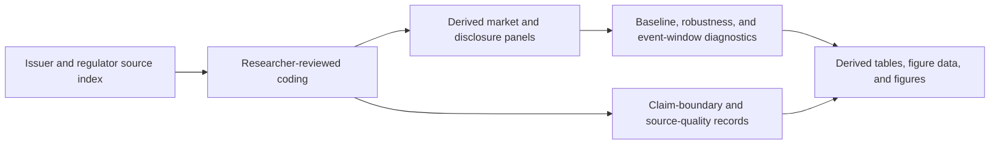

# Conditional Transparency in Stablecoin Markets

[](.github/workflows/replication.yml)
[](requirements.txt)
[](LICENSE)
[](DATA_PROVENANCE.md)
[](CLAIM_BOUNDARY.md)

**Reserve Disclosure, Market Stress, and Reproducible Pilot Evidence**

This repository is a public data and code replication package for a source-audited study of stablecoin reserve disclosure. It connects issuer disclosure records, researcher-reviewed RQI/DII coding, daily market panels, event-window diagnostics, and claim-boundary checks.

The package is intentionally limited to reproducible research materials that can be inspected, rerun, and extended. Only data, code, documentation, and derived replication outputs are included.

## Languages

| Language | README |
|---|---|
| English | `README.md` |
| 中文 | [docs/readme/README.zh-CN.md](docs/readme/README.zh-CN.md) |
| 日本語 | [docs/readme/README.ja.md](docs/readme/README.ja.md) |
| Français | [docs/readme/README.fr.md](docs/readme/README.fr.md) |
| Русский | [docs/readme/README.ru.md](docs/readme/README.ru.md) |

## Repository Map



| Path | Role |
|---|---|
| `00_admin/` | Rule configuration and researcher-review protocols. |
| `01_raw_sources/` | Public notice only; raw third-party source captures are not redistributed. |
| `02_manual_coding/` | RQI/DII coding, event indexes, coding rules, and review records. |
| `03_market_data/` | Derived daily price, supply, and stablecoin metadata panels. |
| `04_processed_data/` | Minimum viable merged panel used by pilot diagnostics. |
| `05_analysis/` | Python scripts and generated analysis outputs. |
| `06_outputs/` | Data dictionary, figure data, and exported figures. |
| `scripts/` | Public release audit and replication runner. |

## Quick Start

```powershell
python -m pip install -r requirements.txt
python scripts\check_public_release.py
python scripts\run_public_replication.py --mode smoke
```

Expected smoke-test counts:

| Dataset | Rows |
|---|---:|
| `02_manual_coding/rqi_dii_pilot_coding_v1.csv` | 36 |
| `02_manual_coding/multi_issuer_disclosure_event_index_v1.csv` | 50 |
| `03_market_data/price_supply_panel_raw_v1.csv` | 6,576 |
| `04_processed_data/minimum_viable_panel_v1.csv` | 1,096 |
| `06_outputs/variable_dictionary_v1.csv` | 143 |

## Replication Commands

```powershell
python scripts\run_public_replication.py --mode analysis
python scripts\run_public_replication.py --mode all
```

The public replication path runs offline from derived CSV files included in this repository. Network collection and raw source archiving are outside the public smoke path.

## Evidence Boundary

This package supports:

- measurement design for Reserve Quality Index (RQI) and Disclosure Information Intensity Index (DII);
- reproducible panel construction and as-of disclosure timing;
- pilot baseline, robustness, and event-window diagnostics;
- source-quality tiering and claim-boundary review.

This package does **not** support final causal estimates, market-wide disclosure generalizations, policy counterfactuals, or investment, legal, or regulatory advice. See [CLAIM_BOUNDARY.md](CLAIM_BOUNDARY.md).

## Data Provenance

Raw issuer PDFs, saved web pages, and third-party source captures are not redistributed. The public package records source URLs, access dates, source status, event identifiers, and review flags. See [DATA_PROVENANCE.md](DATA_PROVENANCE.md) and [01_raw_sources/README_RAW_SOURCES_NOT_INCLUDED.md](01_raw_sources/README_RAW_SOURCES_NOT_INCLUDED.md).

## Citation

Use the repository metadata in [CITATION.cff](CITATION.cff).

## License

Code is released under the [MIT License](LICENSE). Derived datasets, figures, and documentation are released under the terms described in [DATA_LICENSE.md](DATA_LICENSE.md). Third-party source documents referenced by URL remain governed by their original publishers' terms.
